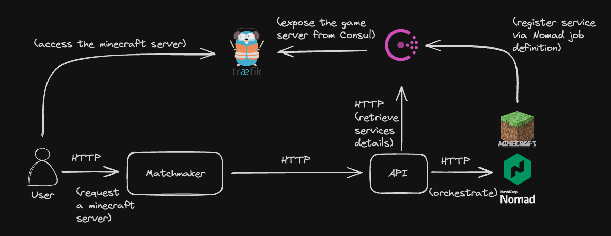

# Demo: Nomad as a game server scheduler

This repository hold a proof of concept of a game server scheduler based on Hashicorp Nomad.
It has been crafted on the side in few days to demonstrate the feasability the advantages of leveraging existing Open Source technology and tools to focus on what brings value to the business rather than designing and developping every bit of the software internally.

It has been demontrated to the target audience as a "Lunch & Learn" demo and does not aim to be used a complete reference point or any kind of tutorial/documentation.

## Architecture

This POC orchestrate a minecraft server (because it was easily accessible) based on request from a matchmaker. The game server accessibility is then automated via service mesh features.

### Matchmaker

This matchmaker is a simple binary (CLI tool) which map a game with the scheduler job and request the API for the gameserver deployment.

From a real use case perspective, it could be seen as: the code that request the platform for a dedicated instance requested by the player for a squad game. It could be also the code from the game that will find the best gameserver instance based on player stats, but since it would drive us a bit too far from what this POC demonstrate, the matchmaker is only written to actually request for new gameserver instance.

### API

The API is the in-house software that links the games with the platform.
In this example, it is built arround the Service-Oriented Architecture because this how was built the APIs where this POC was conduct.

When the matchmaker request a gameserver, the API will register the gameserver job description to Nomad (as a [parametereized job](https://www.nomadproject.io/docs/job-specification/parameterized)) and [dispatch](https://www.nomadproject.io/docs/commands/job/dispatch) the job to create a new instance of a game server.

### Nomad

Nomad is the actual workload orchestrator / scheduler. It runs the API, the gameservers and Traefik (see below).
It could also runs the ElasticSearch/Graylog instances, Consul  ... But because this POC was put together in really short time, it's not the case.

### Consul

Consul is the ServiceMesh part of the platform here. The Nomad's jobs service stanza automatically register informations about the given service in Consul.
These informations are used by the matchmaker and the API to retrieve information about the deployed gameservers and by the EdgeRouting (see below) to make the gameservers accessible outside of the paltform network.

### Edge Routing

[Traefik](https://traefik.io/traefik/) is used to automatically route an access to the gameserver. In a real case scenario, the matchmaker would get the url and port of the gameserver to allow the player to access their instance. In this case, it's avaiable via traefik and Consul (either by the UI or the API).

This screenshot shows a deployment of a minecraft server (minecraft-{UUID}) under the `minecraft` parameterized Nomad job:
(bottom right -> Nomad jobs view)
(top right -> Traefik TCP services view)
(top left -> Consul services view)

This screenshot show the details about the Traefik TCP service with URL and port to access the gameserver:

This screenshot show the details of the Consul service checks with information on how to join the gameserver (serve also as monitoring)

Here's a quick video demonstrating the thing in action:

Quick overview of the architecture:

## Possible Improvements

As mentioned, this is a quick proof of concept that has been put together on free time through few hours and would require some improvements.
Some of thos improvements would be:

- Create a nomad job for ElasticSearch and Grafana so everything is hosted on Nomad (it's actually run with docker-compose)
- Add tests (especially for the matchmacker and the api)
- Standardize the minecraft server nomad jobs (they're all here to demonstrate how to schedule different kind of jobs with Nomad, but the different nomad jobs havenot the same config (for instance: the minecraft-binary does not self register to Traefik))
- Global deployment (pipeline and tooling) could be improved to demnostrate how to properly (simply) deploy such services.
...

